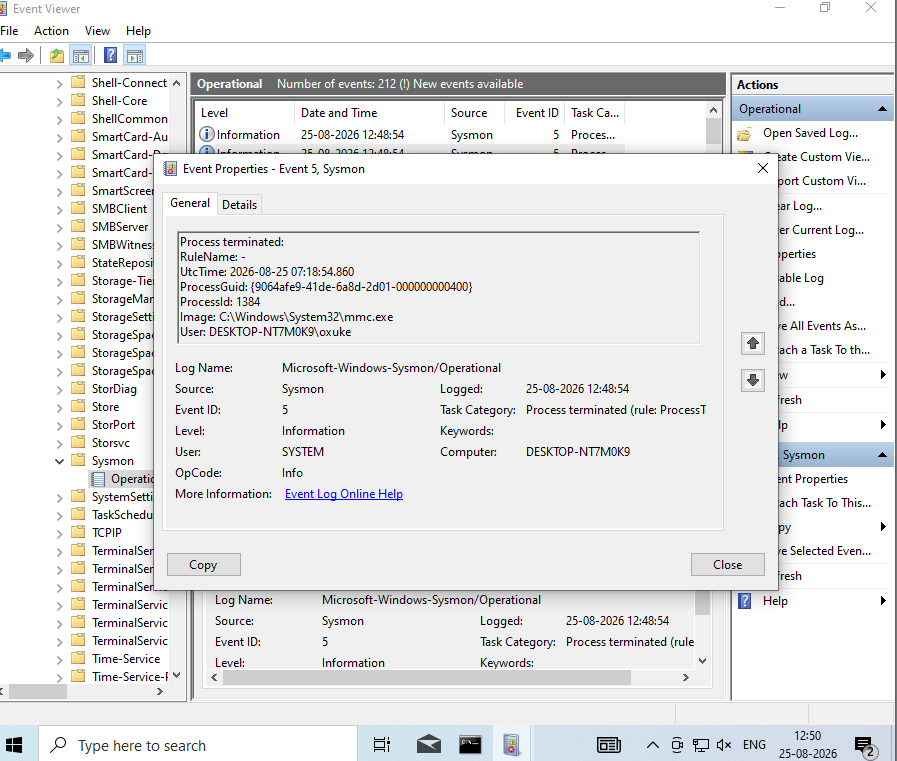
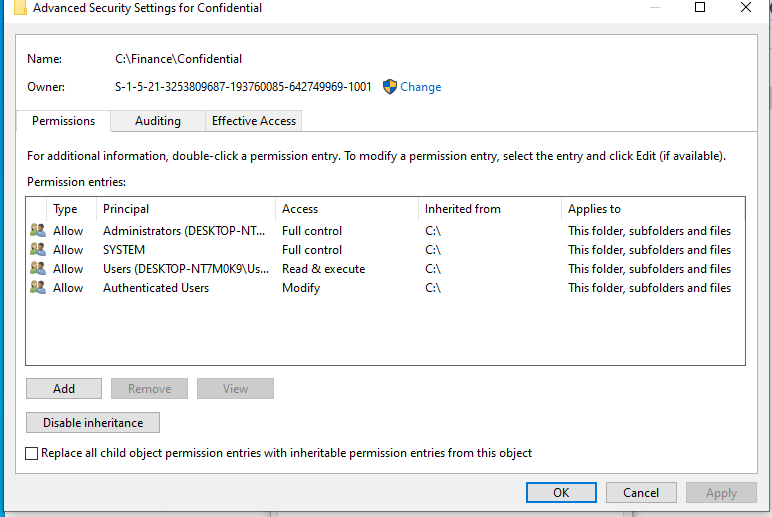
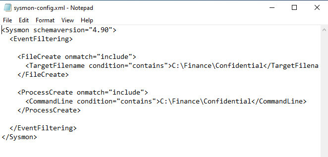
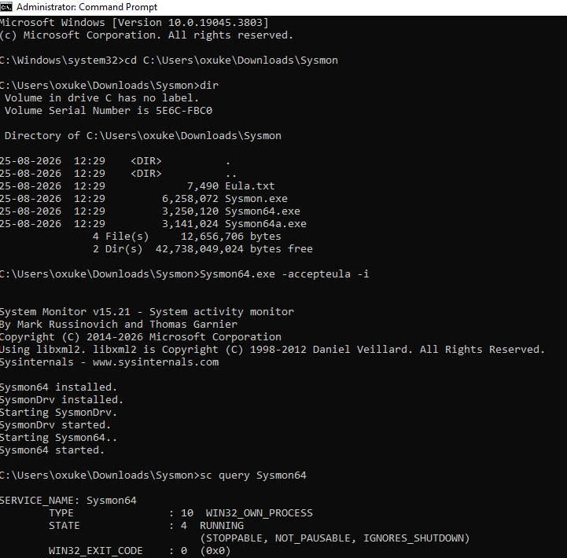
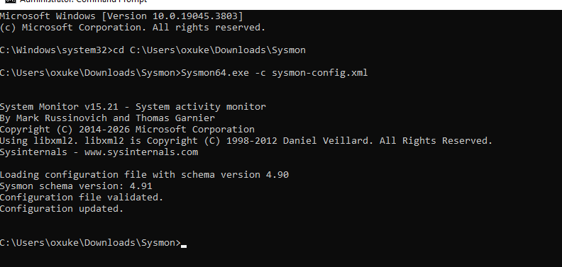
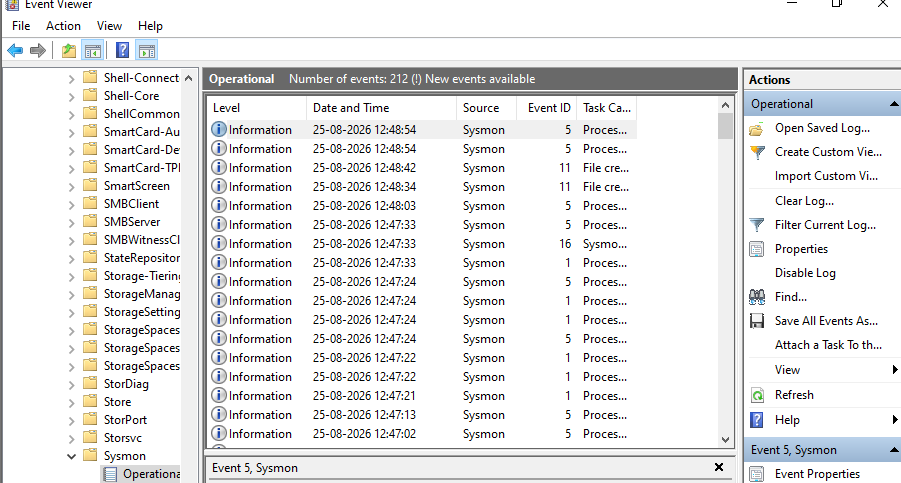
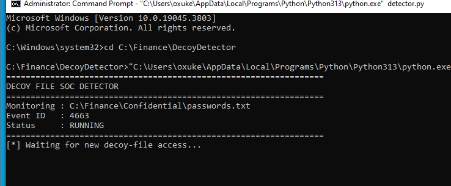
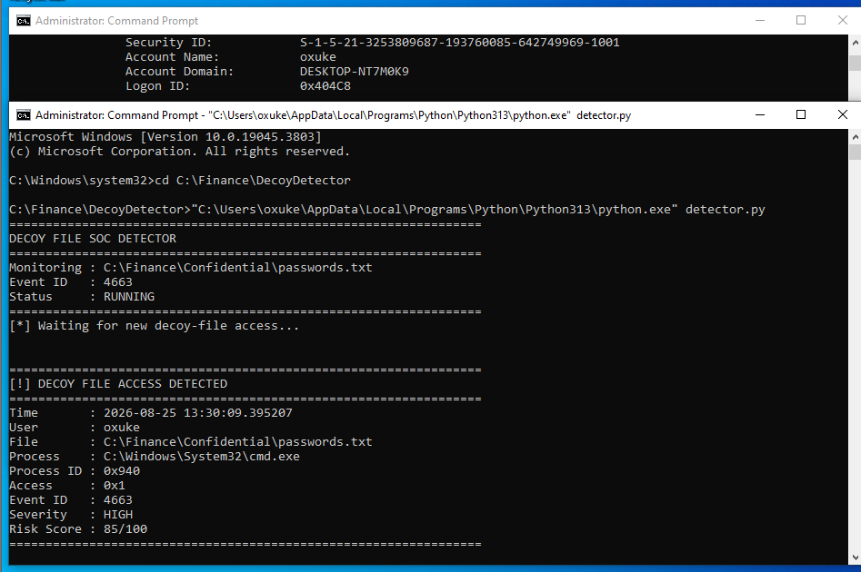

# 🛡️ Windows Decoy File SOC Detector

### A Practical Windows Endpoint Detection & SOC Investigation Lab


---

## 📌 Project Overview

This project demonstrates a practical **Windows endpoint detection scenario** in which a decoy file is used to identify potentially suspicious access to a simulated sensitive location.

The project combines:

- Windows Security Auditing
- Windows Event Logs
- Sysmon
- PowerShell
- Python
- Git/GitHub
- SOC investigation techniques

The goal is not simply to generate an alert.

The goal is to demonstrate the complete process a SOC analyst follows:

> **Generate telemetry → Detect suspicious activity → Investigate the event → Identify the user and process → Assess the risk → Document the findings**

The entire project was performed in a controlled laboratory environment.

---

# 🎯 1. Problem Statement

In a real enterprise environment, attackers may attempt to discover and access files containing sensitive information.

Traditional monitoring may generate large numbers of events, making it difficult for analysts to identify activity that deserves immediate attention.

A **decoy file** can act as an early-warning mechanism.

The idea is simple:

```text
Legitimate User Activity
          │
          ▼
    Normal File Access
          │
          ▼
       No Alert
````

Compared with:

```text
Unexpected User Activity
          │
          ▼
   Decoy File Access
          │
          ▼
   Windows Security Event
          │
          ▼
      Detection
          │
          ▼
    SOC Investigation
```

A decoy file therefore provides a useful signal that can be investigated alongside other endpoint telemetry.

---

# 🧪 2. Lab Scenario

For this project, I created a simulated financial environment on a Windows endpoint.

The directory structure represents a location where sensitive business information could theoretically exist:

```text
C:\Finance\
└── Confidential\
    └── passwords.txt
```

The file is a **decoy**.

No real passwords, credentials, financial records, or confidential company information were used.

The purpose of the file is to generate a detectable security event when it is accessed.

---

# 🏗️ 3. Detection Architecture

The detection workflow used in this project can be represented as:

```text
                 WINDOWS ENDPOINT
                       │
                       ▼
              Confidential Folder
                       │
                       ▼
                  Decoy File
                       │
                       ▼
                File Access
                       │
             ┌─────────┴─────────┐
             ▼                   ▼
      Windows Security         Sysmon
          Events              Telemetry
             │                   │
             └─────────┬─────────┘
                       ▼
                Event Analysis
                       │
                       ▼
                 Python Detector
                       │
                       ▼
                    Alert
                       │
                       ▼
                 SOC Analyst
                       │
                       ▼
              Investigation & Triage
```

This represents a simplified version of an endpoint detection workflow.

---

# 🖥️ 4. Lab Environment

| Component           | Configuration              |
| ------------------- | -------------------------- |
| Operating System    | Windows                    |
| Endpoint            | Windows Lab Machine        |
| Monitoring          | Sysmon                     |
| Security Telemetry  | Windows Security Event Log |
| Scripting           | PowerShell                 |
| Detection Component | Python                     |
| Version Control     | Git                        |
| Repository          | GitHub                     |

---

# 🔧 5. Tools Used

### Windows Security Auditing

Used to generate security events related to object and file access.

### Event Viewer

Used to inspect and investigate generated Windows security events.

### Sysmon

Used to provide additional endpoint telemetry and monitoring visibility.

### PowerShell

Used to perform Windows configuration and controlled testing.

### Python

Used to implement the detection component.

### Git

Used for version control and project management.

### GitHub

Used to document and publish the project.

---

# 🔐 6. Step 1 — Configure Windows Security Auditing

The first step was enabling the Windows auditing required to observe file-access activity.

Without appropriate auditing, a SOC analyst may not have enough telemetry to determine:

* Which account accessed a file
* Which object was accessed
* What type of access occurred
* Which process performed the activity
* When the activity occurred

The auditing configuration therefore forms the foundation of the detection workflow.

### Evidence



**Figure 1 — Windows Security Auditing configuration.**

### SOC Perspective

A detection rule is only as useful as the telemetry behind it.

If the endpoint does not generate the required event, the detection logic cannot reliably identify the activity.

This is why log generation and verification should happen before building detection logic.

---

# 📁 7. Step 2 — Create the Simulated Confidential Directory

The next step was creating a simulated confidential directory:

```text
C:\Finance\Confidential
```

The directory represents a location that could contain sensitive business information.

### Evidence



**Figure 2 — Simulated confidential directory and permissions.**

### Why This Matters

Attackers commonly perform discovery activities looking for interesting files and directories.

Names such as:

```text
Finance
Confidential
Passwords
Credentials
Backup
Database
```

could attract attention during an attack.

For this project, the directory provides a realistic context for the decoy-file detection scenario.

---

# 🪤 8. Step 3 — Create the Decoy File

A decoy file was created inside the simulated confidential directory.

```text
C:\Finance\Confidential\passwords.txt
```

The filename was intentionally chosen to look interesting to an unauthorized user.

The file itself is harmless and contains no real credentials.

### Decoy Concept

The detection model is based on the assumption that unexpected access to a specially monitored file deserves investigation.

```text
Decoy File
     │
     ▼
Unexpected Access
     │
     ▼
Security Telemetry
     │
     ▼
Detection
     │
     ▼
Investigation
```

### Important Note

A decoy alert does **not** automatically mean the system has been compromised.

It is a security signal that requires investigation.

---

# 🛰️ 9. Step 4 — Configure Sysmon

The next stage was configuring Sysmon for additional endpoint visibility.

The Sysmon configuration used in the project is stored in:

```text
config/sysmon-config.xml
```

### Evidence



**Figure 3 — Sysmon configuration.**

### Why Sysmon?

Windows Security logs provide important security information, while Sysmon can provide additional endpoint telemetry.

This can help an analyst understand activity such as:

* Process creation
* Process relationships
* Network connections
* Endpoint activity
* Execution context

The additional telemetry can become especially useful when investigating suspicious events.

---

# ⚙️ 10. Step 5 — Install Sysmon

After preparing the configuration, Sysmon was installed on the Windows endpoint.

### Evidence



**Figure 4 — Sysmon installation.**

The objective was to establish additional endpoint monitoring before performing the detection test.

### SOC Perspective

When an alert is generated, a SOC analyst usually needs more than a single event.

For example:

```text
File Access
     │
     ├── User
     ├── Process
     ├── Parent Process
     ├── Timestamp
     ├── Host
     └── Network Activity
```

Correlating these data points can help determine whether the activity is legitimate or suspicious.

---

# ✅ 11. Step 6 — Apply and Verify the Sysmon Configuration

The Sysmon configuration was then applied and verified.

### Evidence



**Figure 5 — Sysmon configuration applied successfully.**

### Why Verification Matters

Before testing a detection, telemetry should be verified.

Otherwise, a failed detection could be caused by:

* Incorrect configuration
* Missing logging
* Incorrect event filtering
* Incorrect permissions
* Incorrect detection logic

Verification reduces these possibilities before testing begins.

---

# 🧑‍💻 12. Step 7 — Generate Controlled Decoy File Access

The next step was generating controlled access to the decoy file.

The monitored object was:

```text
C:\Finance\Confidential\passwords.txt
```

The access was intentionally generated as part of the laboratory test.

### Testing Methodology

The purpose of controlled testing is to establish a known relationship:

```text
Known Action
     ↓
Expected Event
     ↓
Telemetry Generated
     ↓
Detection Triggered
```

This provides a repeatable method for validating the detection.

---

# 🔎 13. Step 8 — Investigate Windows Event ID 4663

After the decoy file was accessed, the Windows Security Event Log was investigated.

The investigation focused on:

```text
Event ID: 4663
```

Event ID 4663 can provide information about access to an object, including files.

### Evidence



**Figure 6 — Windows Security event investigation.**

The event provides useful investigation fields such as:

* Account
* Object name
* Object type
* Process
* Access type
* Timestamp

---

# 📊 14. Observed Event Details

The captured laboratory event contained information similar to:

```text
Event ID       : 4663
Account Name   : oxuke
Account Domain : DESKTOP-NT7M0K9
Object Type    : File
Object Name    : C:\Finance\Confidential\passwords.txt
Process Name   : C:\Windows\System32\cmd.exe
Access         : ReadData (or ListDirectory)
Access Mask    : 0x1
```

### Key Indicators

| Field       | Observed Value                          |
| ----------- | --------------------------------------- |
| Event ID    | 4663                                    |
| Account     | `oxuke`                                 |
| Host        | `DESKTOP-NT7M0K9`                       |
| Object Type | File                                    |
| File        | `C:\Finance\Confidential\passwords.txt` |
| Process     | `C:\Windows\System32\cmd.exe`           |
| Access      | ReadData / ListDirectory                |
| Access Mask | `0x1`                                   |

---

# 🧠 15. Initial SOC Analysis

At this point, the analyst knows that the decoy file was accessed.

However:

> **The event alone does not prove malicious activity.**

The analyst should investigate the surrounding context.

For example:

### User

```text
oxuke
```

Questions:

* Is this a legitimate account?
* Was the user expected to access the directory?
* Was the account active at this time?
* Were there other suspicious activities?

### Process

```text
C:\Windows\System32\cmd.exe
```

Questions:

* Why was Command Prompt running?
* Who started it?
* What command was executed?
* Was the process launched by another process?

### File

```text
C:\Finance\Confidential\passwords.txt
```

Questions:

* Was this an expected access?
* Were other files accessed?
* Was the file copied or modified?

---

# 🐍 16. Step 9 — Run the Python Detector

The project includes a Python detection component:

```text
detector.py
```

The purpose of the detector is to demonstrate how relevant endpoint activity can be identified automatically.

### Evidence



**Figure 7 — Decoy detector running.**

### Detection Workflow

```text
Security Event
      │
      ▼
Read Event Data
      │
      ▼
Check Relevant Conditions
      │
      ▼
Identify Decoy Access
      │
      ▼
Generate Detection
      │
      ▼
SOC Analyst Investigation
```

### Why Automation?

A production SOC can receive thousands or millions of events.

An analyst cannot manually inspect every event.

Detection logic helps reduce the volume of information and highlight activity that deserves attention.

---

# 🚨 17. Step 10 — Detect the Decoy File Access

The final stage was validating that the detector could identify access to the monitored decoy file.

### Evidence



**Figure 8 — Decoy file access detected.**

The detection confirms that the controlled test activity was successfully identified.

This transforms a raw endpoint event into a security signal that can be investigated.

---

# 🛎️ 18. Example SOC Alert

A simplified alert generated from this scenario could look like:

```text
==================================================
          DECOY FILE ACCESS DETECTED
==================================================

Event ID : 4663

User     : oxuke

Host     : DESKTOP-NT7M0K9

File     : C:\Finance\Confidential\passwords.txt

Process  : C:\Windows\System32\cmd.exe

Access   : ReadData / ListDirectory

==================================================
```

A real SOC would enrich this alert with additional information before assigning severity.

---

# 🕵️ 19. SOC Investigation Workflow

Once the alert is generated, the analyst should perform structured triage.

## 19.1 Identity Investigation

Determine:

* Who is the user?
* Is the account legitimate?
* Is the user authorized to access the directory?
* Was the account recently created?
* Were there unusual authentication events?

---

## 19.2 Endpoint Investigation

Determine:

* Which process accessed the file?
* What was the parent process?
* What command line was executed?
* Were suspicious processes running?
* Were additional files accessed?

---

## 19.3 Timeline Investigation

Review events around the time of the alert.

For example:

```text
Authentication
      ↓
Process Creation
      ↓
Directory Discovery
      ↓
Decoy File Access
      ↓
Other Endpoint Activity
      ↓
Network Activity
```

Timeline analysis can reveal whether the file access was isolated or part of a larger sequence.

---

## 19.4 Network Investigation

If additional telemetry is available, investigate:

* Outbound connections
* Suspicious IP addresses
* Unusual DNS requests
* Remote access
* Data transfer activity

---

# ⚠️ 20. Detection ≠ Compromise

This is an important SOC principle.

A detection should not automatically be classified as a confirmed incident.

The correct workflow is:

```text
Detection
    ↓
Triage
    ↓
Context
    ↓
Correlation
    ↓
Investigation
    ↓
Risk Assessment
    ↓
Classification
```

Possible classifications could include:

```text
Benign / Expected
        OR
Suspicious
        OR
Confirmed Malicious
```

This prevents analysts from treating every alert as a confirmed compromise.

---

# 🧩 21. MITRE ATT&CK Perspective

The behavior observed in this laboratory can be considered in the context of the MITRE ATT&CK framework.

File and directory discovery activity can be relevant when an attacker is searching an endpoint for valuable information.

The project can therefore be extended by mapping observed behaviors to appropriate MITRE ATT&CK techniques and sub-techniques.

A future version of the project can include:

```text
Observed Event
      ↓
Behavior Analysis
      ↓
MITRE ATT&CK Mapping
      ↓
Detection Rule
      ↓
SIEM Alert
```

---

# 📈 22. From Endpoint Detection to SIEM

The current project demonstrates the endpoint portion of a SOC workflow.

A production implementation could extend it into a SIEM:

```text
Windows Endpoint
       │
       ▼
Windows Security Events
       │
       ▼
Sysmon
       │
       ▼
Log Collection
       │
       ▼
SIEM
       │
       ▼
Detection Rule
       │
       ▼
SOC Alert
       │
       ▼
Analyst Investigation
```

Possible SIEM platforms include:

* Splunk
* Wazuh
* Microsoft Sentinel
* Elastic Security

---

# 🔬 23. Detection Engineering Considerations

A useful detection should minimize unnecessary noise while maintaining useful visibility.

For a decoy-file detection, useful conditions could include:

```text
IF

Target file = monitored decoy

AND

Access event = relevant

THEN

Generate alert
```

The detection could then be enriched with:

* Username
* Hostname
* Process
* Parent process
* Timestamp
* Command line
* Source IP
* Related events

This would make the alert more useful to an analyst.

---

# 🧯 24. Incident Response Possibilities

If a future implementation determines that the activity is malicious, the detection could be connected to response actions.

For example:

```text
Decoy Access
     ↓
Alert
     ↓
Analyst Validation
     ↓
Incident Confirmed
     ↓
Contain Endpoint
     ↓
Investigate Account
     ↓
Collect Evidence
     ↓
Eradicate Threat
     ↓
Recover
```

Automated response should be carefully controlled to avoid disrupting legitimate users.

---

# 📂 25. Project Structure

```text
windows-decoy-file-soc-detector/
│
├── config/
│   └── sysmon-config.xml
│
├── screenshots/
│   ├── 01_windows_security_audit.png
│   ├── 02_confidential_folder_permissions.png
│   ├── 03_sysmon_configuration.png
│   ├── 04_sysmon_installation.png
│   ├── 05_sysmon_event_logs.png
│   ├── 06_sysmon_configuration_applied.png
│   ├── 07_decoy_detector_running.png
│   └── 08_decoy_file_access_detected.png
│
├── detector.py
├── requirements.txt
└── README.md
```

---

# 📸 26. Evidence Collected

The project includes screenshots documenting the implementation from configuration through detection.

| Screenshot                               | Evidence                     |
| ---------------------------------------- | ---------------------------- |
| `01_windows_security_audit.png`          | Windows Security Auditing    |
| `02_confidential_folder_permissions.png` | Confidential directory       |
| `03_sysmon_configuration.png`            | Sysmon configuration         |
| `04_sysmon_installation.png`             | Sysmon installation          |
| `05_sysmon_event_logs.png`               | Security event investigation |
| `06_sysmon_configuration_applied.png`    | Configuration verification   |
| `07_decoy_detector_running.png`          | Python detector              |
| `08_decoy_file_access_detected.png`      | Detection result             |

The screenshots are intentionally placed throughout the README to show the progression of the project.

---

# 📚 27. Key Learnings

This project helped demonstrate several practical SOC concepts.

### 1. Endpoint Visibility

Security monitoring starts with collecting the right telemetry.

### 2. Windows Event Investigation

Event ID 4663 can provide useful information when investigating file-access activity.

### 3. Sysmon

Sysmon can provide additional endpoint visibility that helps analysts investigate suspicious behavior.

### 4. Detection Engineering

Raw logs are not enough.

Relevant events need to be identified and transformed into actionable detections.

### 5. SOC Triage

An alert requires investigation and context before a final classification.

### 6. Automation

Python can be used to automate parts of the detection workflow.

### 7. Documentation

A good security project should show not only the final result, but also how the result was achieved.

---

# 🚧 28. Current Limitations

This project is intentionally designed as a small laboratory demonstration.

Current limitations include:

* Single Windows endpoint
* Limited detection scope
* No centralized SIEM
* Limited event correlation
* No enterprise-scale log ingestion
* No automated endpoint isolation
* No automated incident response
* No production alert management

These limitations provide clear opportunities for future development.

---

# 🚀 29. Future Improvements

The project can be expanded in several directions.

## SIEM Integration

Send the generated telemetry to:

* Splunk
* Wazuh
* Microsoft Sentinel
* Elastic Security

## Multiple Decoys

Deploy multiple decoy files and directories.

## Risk Scoring

Assign severity based on:

* User
* Process
* File
* Host
* Frequency
* Time of activity

## MITRE ATT&CK Mapping

Map detections to relevant ATT&CK techniques.

## Alert Enrichment

Automatically enrich alerts with endpoint and identity information.

## SOC Dashboard

Build a dashboard showing:

* Decoy accesses
* Users
* Hosts
* Processes
* Timestamps
* Alert severity

## Automated Response

Introduce controlled response actions after analyst validation.

---

# 🧾 30. Security Considerations

This project was designed as a controlled cybersecurity laboratory.

The following precautions were followed:

* No real credentials were intentionally used.
* No real financial data was used.
* The confidential directory was simulated.
* The decoy file was created for detection purposes.
* Testing was performed on a controlled endpoint.
* The project does not target third-party systems.

---

# 🏁 31. Conclusion

This project demonstrates how a simple decoy file can become a useful endpoint detection mechanism when combined with Windows auditing, Sysmon, Python, and SOC investigation techniques.

The important part of the project is not the decoy file itself.

The important part is the workflow:

```text
Create Detection Surface
        ↓
Generate Telemetry
        ↓
Observe Security Event
        ↓
Identify Relevant Activity
        ↓
Generate Alert
        ↓
Investigate Context
        ↓
Assess Risk
        ↓
Document Findings
```

This is the basic mindset required when working in a Security Operations Center.

The project also demonstrates an important principle:

> **Good detection is not just about finding suspicious activity. It is about providing enough context for an analyst to make the right decision.**

---

# 👨‍💻 Author

## Katakam Likith Kumar

**Information Security Graduate | Cybersecurity Enthusiast**

Areas of interest:

* Security Operations Center (SOC)
* Detection Engineering
* Incident Response
* Security Monitoring
* Governance, Risk & Compliance
* Vulnerability Assessment
* Information Security

---

# ⭐ Project Purpose

This repository was created as a cybersecurity portfolio project to demonstrate practical experience with:

```text
Windows Security
      +
Sysmon
      +
Python
      +
Security Events
      +
Detection
      +
SOC Investigation
```

The project focuses on demonstrating practical security monitoring and investigation concepts in a controlled environment.

